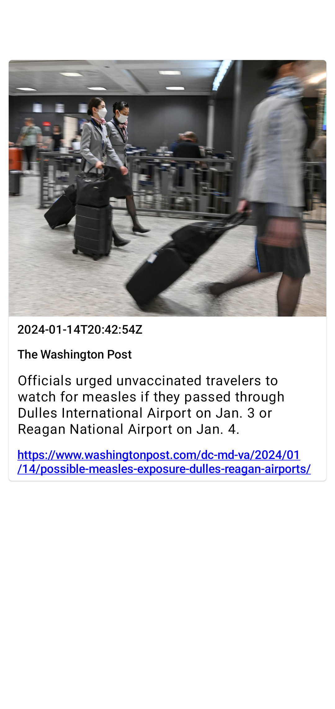
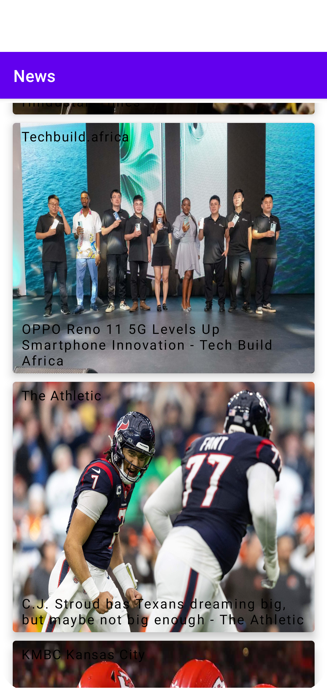

# NewsWave
A Simple News App built with Kotlin &amp; Compose.

## To Do List

- [ ] Handle offline case
- [ ] Add information messages
- [ ] Make text clear on image
- [ ] Search bar

## Built With 🛠
- [Kotlin](https://kotlinlang.org/) - First class and official programming language for Android development
- [Jetpack Compose](https://developer.android.com/jetpack/compose) - Modern Android UI Library for building seemless applications
- [Coroutines](https://kotlinlang.org/docs/reference/coroutines-overview.html) - For asynchronous and more..
- [Flow](https://kotlin.github.io/kotlinx.coroutines/kotlinx-coroutines-core/kotlinx.coroutines.flow/-flow/) - A cold asynchronous data stream that sequentially emits values and completes normally or with an exception

- [Android Architecture Components](https://developer.android.com/topic/libraries/architecture) - Collection of libraries that help you design robust, testable, and maintainable apps
  - [ViewModel](https://developer.android.com/topic/libraries/architecture/viewmodel) - Stores UI-related data that isn't destroyed on UI changes
  - [Navigation Components](https://developer.android.com/guide/navigation/navigation-getting-started) - Navigate fragments easier
  
- [Dependency Injection](https://developer.android.com/training/dependency-injection)
  - [Dagger](https://dagger.dev/) - Fundamental framework providing compiler time and full static dependency injection
  - [Hilt](https://dagger.dev/hilt) - Easier way to incorporate Dagger DI into Android application

- [Retrofit](https://square.github.io/retrofit/) - A type-safe HTTP client for Android and Java

## Screenshots

